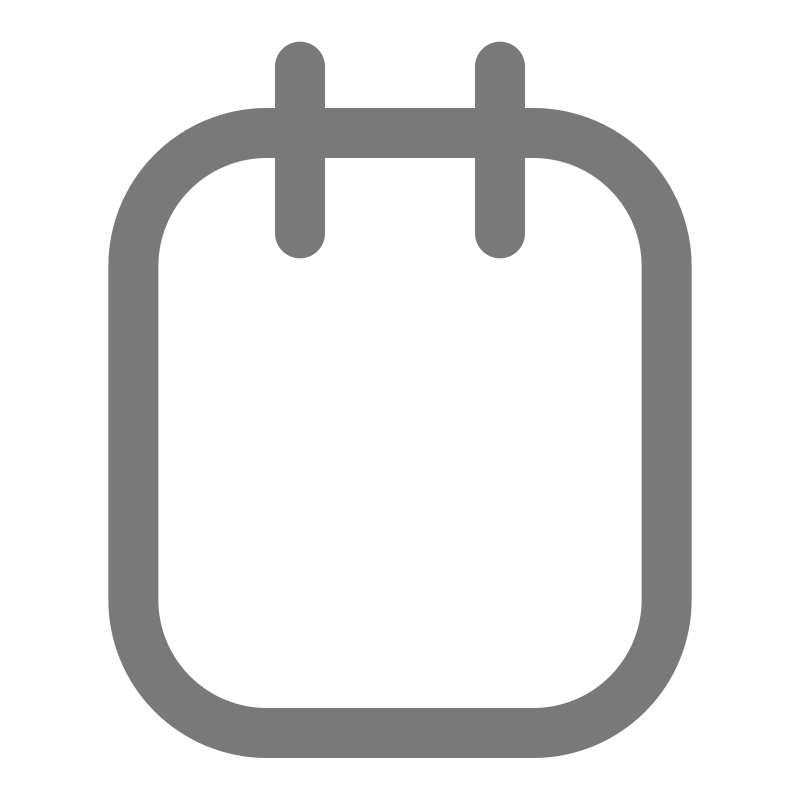
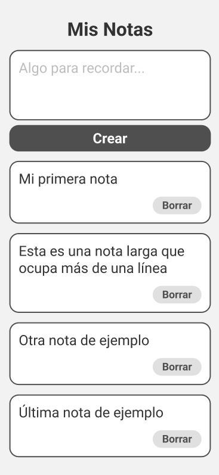
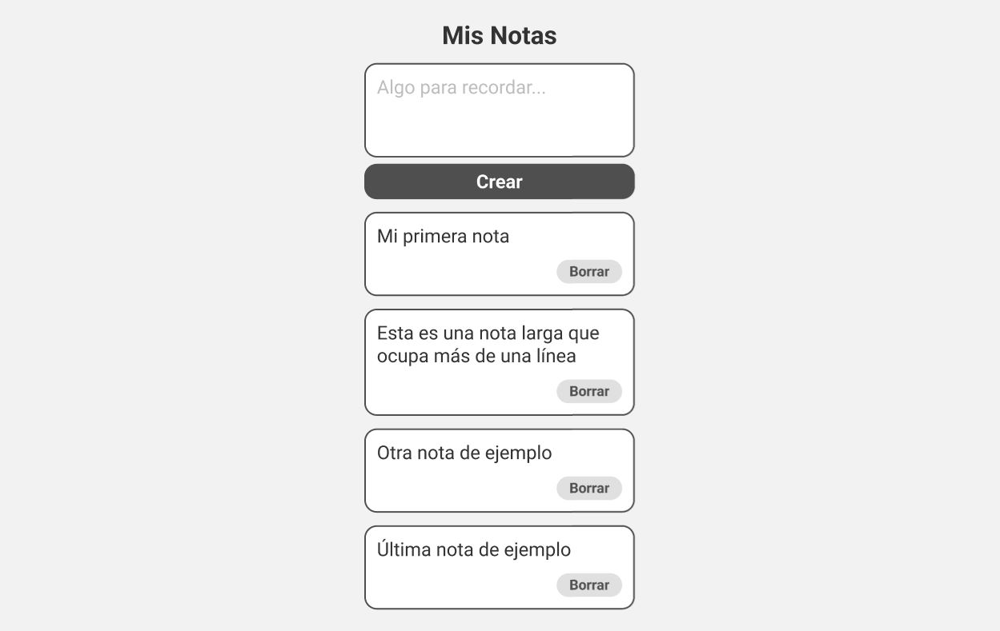

<h1 align="center" style="padding:0;">Notes App Challenge 
<h1/>

## About

Esta aplicación es un challenge de Codeable y Neele-Vat. La aplicación debe gestionar las notas, por lo tanto debe manejar las siguientes funcionalidades:

- **Crear nueva nota:** El usuario deberá poder escribir una nueva nota y presionar el botón "crear" para agregar una nueva nota a la lista. La nueva nota debe aparecer al final de la lista.
- **Ver las notas creadas:** La aplicación debe mostrar una lista de todas las notas creadas hasta el momento. Cada nota debe mostrar su texto y un botón "Borrar".
- **Eliminar notas:** El usuario debe ser capaz de eliminar una nota presionando su botón "Borrar".

## Requerimientos Técnicos

- La aplicación debe desarrollarse usando HTML, CSS y JavaScript.
- Los estilos (el CSS) deben acercarse lo más posible al siguiente diseño:
  - **Vista para móbiles**
    
  - **Vista para escritorio**
    
- La aplicación debe "recordar" las notas que el usuario a creado cuando se refresque la página.

## Aplicación Desplegada

Prueba la aplicación aquí 👉👉👉: https://notes-app-codeable-neele-vat.onrender.com/
